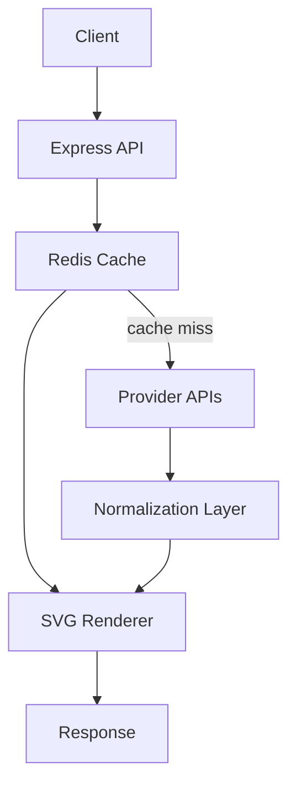

<h1 align="center">GreenJ ReadMe Statistics</h1>
<p align="center">
  High-performance API aggregation and caching service for GitHub, LeetCode, and WakaTime developer statistics.
</p>

<p align="center">
  <strong>Tech:</strong> TypeScript • Express • Redis • REST • GraphQL • Docker • Cron Jobs • SVG Rendering
</p>

<p align="center">
  <a href="./API.md">Public API Documentation</a> •
  <a href="https://greenj-readme-stats.onrender.com">Live Deployment</a>
</p>

<h2>📌 Overview</h2>
<p>
  GreenJ ReadMe Statistics is a backend-focused statistics aggregation service that retrieves, normalizes, caches, and renders developer metrics from multiple external platforms.
</p>
<p>
  The system integrates with GitHub, LeetCode, and WakaTime APIs to generate dynamically rendered SVG statistic cards while minimizing upstream API load through Redis caching and scheduled background refresh jobs.
</p>
<p>
  The project focuses on API orchestration, distributed caching strategies, dynamic SVG rendering, and infrastructure-aware backend system design.
</p>

<h3>🏗️ System Architecture</h3>
<ul>
  <li>Express API layer written in TypeScript</li>
  <li>Provider-specific integrations for GitHub, LeetCode, and WakaTime</li>
  <li>Redis caching layer for response storage and refresh coordination</li>
  <li>SVG rendering pipeline for dynamically generated statistic cards</li>
  <li>Cron-based background refresh jobs for cache warming</li>
  <li>Dockerized deployment workflow for local and production environments</li>
</ul>
<p>
  The system separates provider integrations, caching, rendering, and scheduling responsibilities so each layer can evolve independently.
</p>



<h3>🧩 System Boundaries</h3>
<ul>
  <li>The API server is stateless</li>
  <li>Redis stores cached provider responses and refresh metadata</li>
  <li>Third-party APIs remain the source of truth for developer statistics</li>
  <li>SVG rendering occurs dynamically from normalized provider data</li>
  <li>Background refresh jobs reduce expensive synchronous requests</li>
</ul>
<p>
  This architecture minimizes repeated upstream requests while maintaining responsive rendering performance.
</p>

<h3>⚡ Caching Architecture</h3>
<ul>
  <li>External API responses are cached in Redis to reduce repeated upstream requests</li>
  <li>Cache entries use expiration windows to balance freshness and performance</li>
  <li>Background refresh jobs proactively update commonly requested statistics</li>
  <li>Redis significantly reduces external API latency and rate-limit pressure</li>
</ul>
<p>
  The caching layer is a core architectural component because upstream providers expose different latency profiles and rate-limiting constraints.
</p>

<h3>🕒 Background Refresh System</h3>
<ul>
  <li>Users can register routes for scheduled refresh intervals</li>
  <li>Cron jobs periodically refresh cached statistics in the background</li>
  <li>Precomputed cache updates reduce expensive real-time recomputation</li>
  <li>Refresh workflows improve responsiveness during high request volume</li>
</ul>
<p>
  The refresh system helps maintain responsive rendering performance while reducing direct dependency on live upstream API availability.
</p>

<h3>🔌 API Aggregation Pipeline</h3>
<ul>
  <li>GitHub statistics retrieved through REST APIs</li>
  <li>LeetCode data gathered through GraphQL queries and parsing strategies</li>
  <li>WakaTime metrics retrieved through authenticated API requests</li>
  <li>Provider responses normalized into a shared SVG rendering pipeline</li>
</ul>
<p>
  Each provider exposes different schemas and response structures, requiring provider-specific transformation logic before rendering.
</p>

<h3>⚙️ SVG Rendering System</h3>
<ul>
  <li>Statistic cards are rendered dynamically as SVG images</li>
  <li>Scales cleanly across devices and resolutions</li>
  <li>Lightweight network responses with no frontend application runtime required</li>
  <li>Rendering pipeline supports parameterized customization options</li>
  <li>Theme support allows light and dark mode rendering</li>
  <li>Generated images are designed for GitHub profile and markdown compatible integration</li>
</ul>
<p>
  SVG rendering enables lightweight, embeddable statistic visualization without requiring frontend application hosting.
</p>

<h3>📈 Performance Considerations</h3>
<ul>
  <li>Redis caching minimizes repeated external API requests</li>
  <li>Background refresh jobs reduce synchronous computation costs</li>
  <li>SVG rendering avoids heavier frontend rendering workflows</li>
  <li>Dockerized deployment improves environment consistency</li>
  <li>Provider-specific handling helps mitigate external rate limits</li>
</ul>

<h3>⚠️ Failure Modes & Operational Considerations</h3>
<ul>
  <li>External API outages can temporarily impact statistic freshness</li>
  <li>Rate limiting from third-party providers requires aggressive caching strategies</li>
  <li>Cache expiration windows trade freshness for performance</li>
  <li>Background refresh timing must balance API utilization and data accuracy</li>
  <li>Provider schema changes may require parser and normalization updates</li>
</ul>
<p>
  These operational constraints informed the decision to prioritize caching, normalization, and asynchronous refresh workflows.
</p>

<h3>🚀 Future Scaling Considerations</h3>
<ul>
  <li>Distributed Redis clustering for higher cache throughput</li>
  <li>Queue-based refresh workers for decoupled background processing</li>
  <li>Rate-limit aware adaptive refresh scheduling</li>
  <li>Persistent metric snapshot storage for historical analytics</li>
  <li>Horizontal API scaling behind a reverse proxy/load balancer</li>
</ul>

<h3>🐳 Deployment Architecture</h3>
<ul>
  <li>Application packaged as a Docker container for deployment consistency</li>
  <li>CI/CD pipeline validates builds and deployment readiness</li>
  <li>Production deployment currently hosted on Render</li>
  <li>Redis cloud instance used for distributed cache persistence</li>
</ul>
<p>
  Containerization allows the application to maintain consistent runtime behavior across development and production environments.
</p>

<h3>🧪 Testing & Validation</h3>
<ul>
  <li>Jest used for functional and API testing</li>
  <li>Postman used for route validation and API inspection</li>
  <li>CI/CD pipeline validates production deployment readiness</li>
</ul>

<h2>Getting Started</h2>

<h3>Steps:</h3>
<ol>
  <li>Clone the repository</li>
  <li>Navigate to the project directory</li>
  <li>Install dependencies</li>
  <li>Configure the application's environment variables from template file</li>
  <li>Start the Redis instance (if using a local Redis server)</li>
</ol>

```bash
git clone https://github.com/GreenJ84/github-readme-stats-typescript.git # 1

cd github-readme-stats-typescript # 2

npm install # 3

mv .env.template .env # 4 - Fill in based on template instructions

brew services start redis # 5 - If using local redis on macOS
sudo systemctl start redis-server # 5 - If using local redis on Linux
sudo service redis-server start # 5 - If using local redis on Windows
redis-server # 5 - If using local redis with direct invocation (Linux/MacOS)
```

<h3>▶️ Local Development</h3>

<h3>Requirements</h3>
<ul>
  <li>Node.js</li>
  <li>Redis instance (local or cloud)</li>
</ul>

<h3>Run the development server</h3>

```bash
npm run dev # 2
```

<p>
  The API server will start on:
</p>

```text
http://localhost:8000
```

<h3>🐳 Docker Deployment</h3>

<h3>Requirements:</h3>
<ul>
  <li>Docker Engine</li>
</ul>

<h3>Steps:</h3>
<ol>
  <li>Build the Docker image</li>
  <li>Run the Docker container</li>
</ol>

<h3>Build Container</h3>

```bash
docker build -t greenj-readme-stats . # 1

docker run -p 8000:8000 -d greenj-readme-stats # 2
```

<h2>🪪 License</h2>
<p>
  This project is licensed under the MIT License - see the <a href="/License.md">LICENSE.md</a> file for details.
</p>
<p>
  The MIT License is a permissive license that allows users to use, copy, modify, merge, publish, distribute, and sublicense the software, provided that they include the original copyright notice and disclaimer. It also provides an implied warranty of fitness for a particular purpose and limits the liability of the software's authors and contributors.
</p>
<p>
  By using or contributing to this project, you agree to be bound by the terms and conditions of the MIT License.
</p>
<p>
  If you have any questions about the license or would like to use this software under a different license, please contact the project maintainers.
</p>

<h2>🤗 Contributing</h2>
<p>Contributions are welcome!</p>
<p>
  Please refer to my profile <a href="https://github.com/GreenJ84/GreenJ84/blob/main/profile_code_of_conduct.md#contributor-code-of-conduct">Code of Conduct</a> before contributing to this project.
</p>
<p>
  My <a href="https://github.com/GreenJ84/GreenJ84/blob/main/profile_contributions.md.md#profile-contributions-guidline">Contribution Guide</a> has more details on how to get started contributing.
</p>
<p>
  Feel free to open an <a href="https://github.com/GreenJ84/greenj-readme-statistics/issues/new/choose">issue</a> or submit a <a href="https://github.com/GreenJ84/greenj-readme-statistics/compare">pull request</a> if you have a way to improve this project.
</p>
<p>
  Make sure your request is meaningful, thought out, and that you have tested the app locally before submitting a pull request.
</p>


<h2>💙 Support</h2>
<p>If you like this project, give it a ⭐ and share it with friends!</p>
<p align="left">
  <a href="https://github.com/sponsors/GreenJ84">
    
  </a>
</p>

<!-- [☕ Buy me a coffee]() -->

---

Made with TypeScript, Express, Redis and ❤️‍🔥

<a href="https://render.com/"></a>
